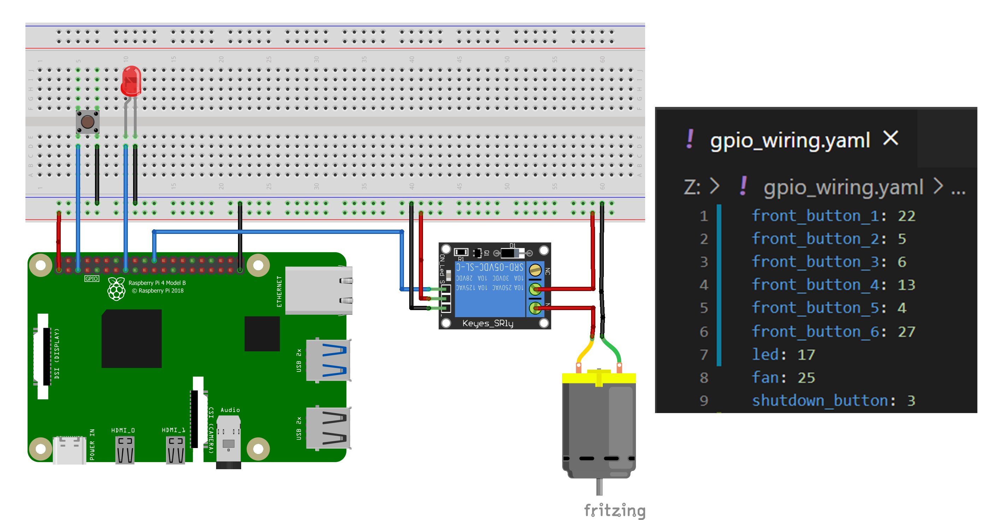
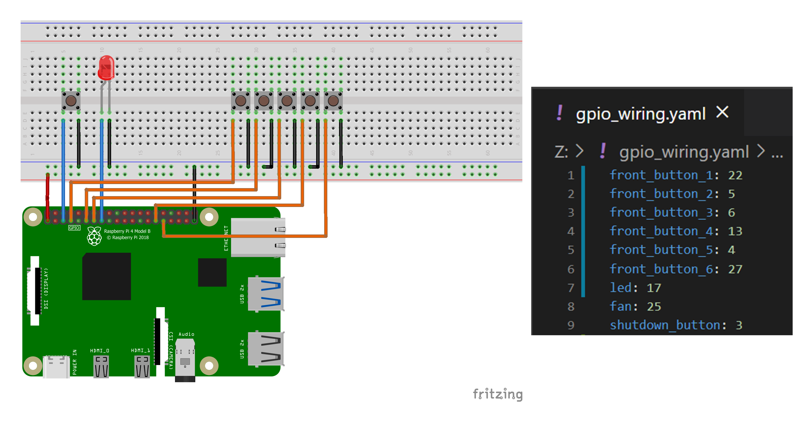
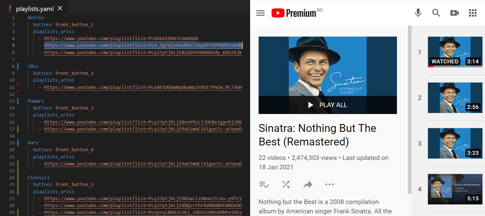

# Media-Jukebox

  

## Project Overview
Media-Jukebox is a personal DIY Project that brings elegant ease-of-use to playing media. 

*Ever got lost browsing YouTube aimlessly?* 

Create **Themes** fitting your mood and add any number of YouTube playlist to instantly create epic atmosphere with the touch of a button.

The Project details both the electrical implementation and provides the code neccessary Python code. 

## Main Components

Below, the main modules are described.

### `peripherals.py`
- handles the `shutdown_button`
- controls the Raspberry Pi fan

**ON/OFF button on Raspberry Pi**
Wiring a button between `GPIO3` and `GND` allows for turing on a Raspberry Pi that is in stand by (shutdown but still powered).
After booting up, the `peripherals.py` script watches for the same `GPIO3` pin - if the button is pressed, it initiates the shutdown procedure.

To shutdown the Raspberry Pi, simply hold the ON button for more than 3 seconds (when the LED flashes the second time).

**Fan**
A small fan is required for safely operating the Raspberry Pi. It can be wired to the `3.3V` pin but then it would still be powered when the Raspberry Pi is shutdown. Therefore it must be controlled with a GPIO pin, but the pins cannot handle large cutrrents, so an *optocoupler* is used. (In this project a standard *relay* is used.)

**LED**
The LED on the front panel is used to signal the press of a button.

**Wiring and GPIO Map**
Make sure that the GPIO pins specified in the `gpio_wiring.yaml` respect the electrical wiring.

  

### `youtube_jukebox.py`
- handles the buttons and selects the Themes accordingly
- gets the YouTube videos URLs for each Theme

**Themes**
Each Theme (*Retro*, *70s*, etc.) has a corresponding button on the front panel. A Theme is a collection of **YouTube Playlists**, specified in the `playlists.yaml` file. 

**Themes Buttons**
A short press of a button (<3 seconds) selects the corresponding Theme and plays a random song. If the Theme is already selected, it will play the next song. A long press of a button (>3 seconds, signalled by the second blinking of the LED) deselects the playing Theme.

**Wiring and GPIO Map**
Make sure that the GPIO pins specified in the `gpio_wiring.yaml` respect the electrical wiring.

  

**YouTube Playlists to Theme**
You can add as many playlists as you like in the `playlists.yaml` file. Specify the Theme name and its corresponding button and you're set. 

  

### `movie_jukebox.py`

## Adding youtbe playlists

### `playlists.yaml`

## Playing Movies

